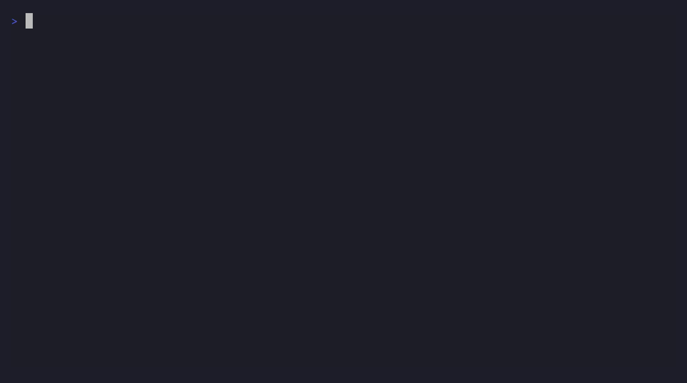

# jvmlens

Turn JVM runtime evidence into a compact, **LLM-ready** diagnosis.



> _Ask an AI to "debug this": a raw JFR dump is ~680K tokens and **overflows the model's
> context** — it can't even read it. Piped through `jvmlens analyze` first (~400 tokens),
> Claude pins `Workload.expensiveHashLoop` (99%) and the fix. The demo is reproducible and
> renders offline (golden-replay) — see [`assets/demo/`](assets/demo/) (`./render.sh`)._

Profiling a JVM is well-served for *humans* — async-profiler, JFR, and the
commercial GUIs all produce flamegraphs and recordings. None of those formats
are built for an **LLM** to reason over: a `jfr print` dump of a short recording
is hundreds of thousands of tokens and routinely overflows a model's context
window. jvmlens reads a JFR recording and emits a few hundred tokens of ranked,
source-attributed signal you can hand straight to a coding agent.

## What it captures

Beyond the classic three (CPU / memory / wait), jvmlens summarizes **external I/O**,
**virtual-thread pinning**, **deadlocks**, and — via the in-process agent — **SQL**,
**HTTP endpoints**, **messaging**, **cache**, and **Micrometer** timers, plus **variable
snapshots** for correctness and a hedged **cross-dimension correlation** that ties a slow
endpoint to its query, hot path, and GC. Every row carries an absolute hit count, sections
are tagged `[sampled]` vs `[measured]`, and the heuristic under-interprets (it never claims
a confident "leak").

## Inputs & commands

| Command | What |
|---|---|
| `analyze <file.jfr\|dir>` | Summarize a recording, or a **JMH `-prof jfr` directory** (forks merged). |
| `profile <pid>` | Live attach + timed JFR capture; `--engine async` for native frames; `-w/--warmup`, `-k/--keep`. |
| `watch <pid>` | Continuous ring buffer — periodic, or **dump-on-trigger** (`--on-gc-ms`/`--on-cpu-pct`/`--on-old-objects`). |
| `trend <history.jsonl>` | Reduce a multi-day agent run to a **change-over-time** digest. |
| `control <file> <cmd…>` | **In-flight** control of a running agent (no ports/JMX). |
| `mcp` | Stdio MCP server — scoped tools per dimension; reachable over `ssh`. Serves data only. |
| `-javaagent:jvmlens-agent.jar` | In-process, container-native; periodic summaries, `history=`, per-dimension opt-in. |
| `-prof …JvmlensProfiler` | JMH profiler plugin — prints the summary inline after a benchmark trial. |

Output is markdown / JSON / LLM-prompt (`-f`), narrowable to one concern (`-r`), and scoped
to your packages (`-a`/`-x`). For remote servers, run jvmlens *on the host* (ssh / kubectl /
docker exec) — only the few-hundred-token summary travels back.

## Optimize → measure loop

The agent perf loop, all from the one engine: **diff** two recordings (`analyze --baseline
before after` — anchored on absolute bytes/ms/samples, so an optimize-loop reduction isn't
mislabelled a regression), **gate** a regression in CI (`--assert "alloc-pct < 0, gc-pct <
10"` — non-zero exit), get hedged **fix directions** (`--hints`), and **budget** the size
(`--top-k` / `--max-tokens`). Pairs with JMH — JMH gives the number, jvmlens gives the
where/why.

## Runtime control (in-flight)

Like a desktop profiler's live controls, the agent can be steered without a restart through a
**watched control file** — start/stop, `enable`/`disable` a dimension, switch sampling
density, adjust filtering, set per-section top-N — via `jvmlens control <file> <cmd>` (run on
the host). Launching `paused` and starting after warm-up is the clean fix for short cold runs
profiling startup. See **[Usage → Runtime control](docs/modules/ROOT/pages/usage.adoc)**.

## Why

A 20-second `profile`-settings recording of a hot loop dumps **~380K tokens** of
raw `jfr print` — too big to paste. jvmlens turns the same recording into a
**~400-token** summary that names the hot application method, the leaking
allocation site, or the contended lock. For an LLM, the summary isn't just
cheaper — for non-trivial recordings it's the only input that fits.

## Install

**Library — Maven Central.** Embed the summarizer (the dependency-free engine, only
`jdk.jfr.consumer`):

```xml
<dependency>
  <groupId>org.alexmond</groupId>
  <artifactId>jvmlens-engine</artifactId>
  <version>0.1.0</version>
</dependency>
```

**CLI / agent / JMH jars — GitHub releases.** These are runnable artifacts (not library
deps), so they ship as release assets, not on Central. Java 17+ to run:

```bash
# the latest tagged release
gh release download v0.1.0 -R alexmond/jvmlens -p 'jvmlens.jar'
# …or the rolling pre-release (every green build on main), no build required:
curl -L -o jvmlens.jar https://github.com/alexmond/jvmlens/releases/download/latest/jvmlens.jar
java -jar jvmlens.jar analyze recording.jfr
```

Each release also carries `jvmlens-agent.jar` (the in-process `-javaagent`) and
`jvmlens-jmh.jar` (the JMH profiler). The `latest` URL is stable — it always points at the
newest green build on `main`.

## Build

```bash
mvn -q clean package
```

## Use

```bash
# analyze an existing JFR recording (markdown by default) — use the downloaded jar,
# or jvmlens-cli/target/jvmlens.jar if you built from source
java -jar jvmlens.jar analyze recording.jfr

# or emit scoped JSON / an LLM-ready prompt
java -jar jvmlens.jar analyze -f json recording.jfr
java -jar jvmlens.jar analyze -f prompt recording.jfr

# or during development
mvn -q spring-boot:run -Dspring-boot.run.arguments="analyze,recording.jfr"
```

Example output:

```
# JVM profile summary (recording.jfr)

Events: 1738 exec samples, 8 alloc types, 2 old-object samples, 10 GC pauses (62 ms).

## Top hot paths (application code, by sample share)
- `com.example.OrderService.reprice` — 100%  (com.example.OrderService.reprice <- ...)
...
## Suspected cause (heuristic)
- CPU-bound — `com.example.OrderService.reprice` accounts for the majority of samples.
```

## Use it from another project

Want to profile a *different* JVM project (say `builder`) with jvmlens?
**[INTEGRATING.md](INTEGRATING.md)** is a portable, copy-paste guide: a decision
table over the integration paths (analyze a `.jfr`, attach to a running pid, the
always-on `-javaagent`, an MCP server for coding agents, a Kubernetes sidecar), a
drop-in `profile.sh`, and a CLAUDE.md snippet to paste into the target project.

## Try it end-to-end

`examples/Workload.java` is a planted-pathology workload (CPU hot path, a memory
leak, lock contention) for producing sample recordings. See `examples/README.md`.

## Design & roadmap

This project graduated from a structured incubation; the design thinking and plan
came with it so work can continue uninterrupted:

- **[DESIGN.md](DESIGN.md)** — architecture (one engine, two front-ends), key
  decisions (frame attribution, MCP scoped tools, capture modes, prod-vs-dev,
  LLM egress), the v2 variable-snapshot direction, and competitive positioning.
- **[ROADMAP.md](ROADMAP.md)** — staged plan with effort and the immediate next step.
- **[examples/experiments.md](examples/experiments.md)** — how to validate
  summary quality against the planted-pathology workload.
- **[docs/competitor-analysis.md](docs/competitor-analysis.md)** — the profiling /
  observability landscape (continuous profilers, JProfiler/YourKit/JMC, APM/OTel,
  Glowroot) and where jvmlens differs, plus **[docs/extended-profiling.md](docs/extended-profiling.md)**
  — the epics for going beyond CPU/memory/wait into web/db/messaging.

## License

Apache License 2.0 — see [LICENSE](LICENSE).
